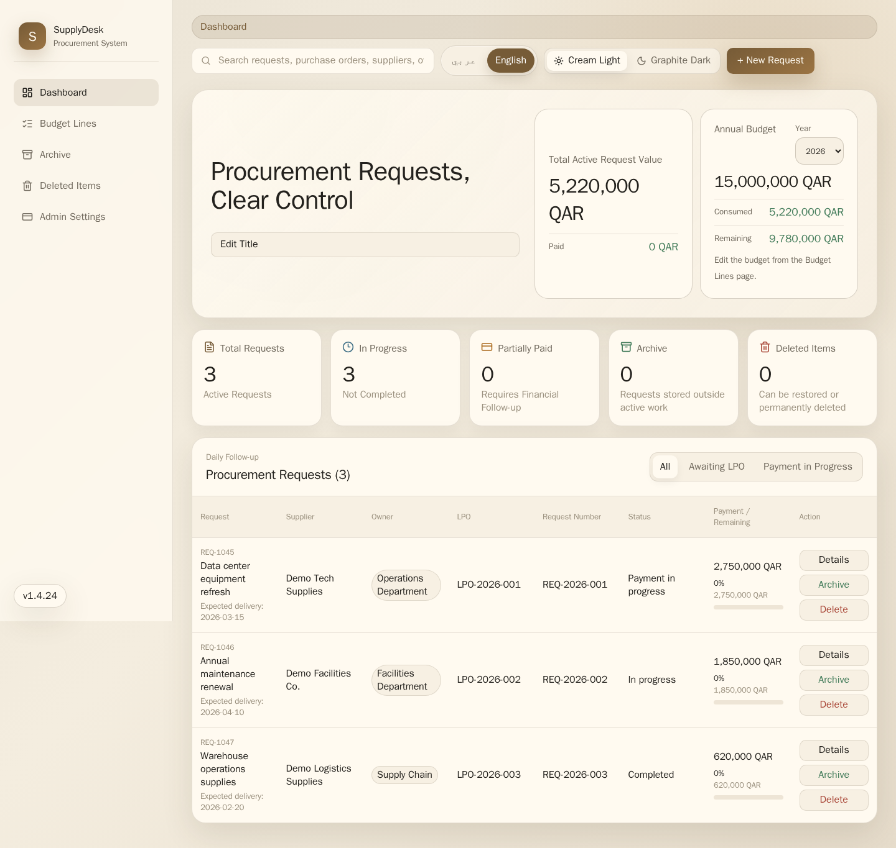

# SupplyDesk

**Procurement request, LPO, supplier, payment, and budget tracking dashboard.**

SupplyDesk is a bilingual web app for internal procurement teams. It tracks requests, LPOs, suppliers, payments, budget lines, archives, and deleted items in one clean dashboard.

**Live landing page and full setup guide:** <https://wesker10.github.io/SupplyDesk/>



## Quick start

Production Docker Compose uses the published image and starts PostgreSQL automatically:

```bash
git clone https://github.com/wesker10/SupplyDesk.git
cd SupplyDesk
cp .env.example .env
docker compose up -d
```

Open:

```text
http://localhost:3000
```

## Development

Build the image locally from source:

```bash
docker compose -f docker-compose.dev.yml up -d --build
```

Run with Node.js:

```bash
npm install
npm test
npm run build
npm start
```

## Links

- Landing page and installation guide: <https://wesker10.github.io/SupplyDesk/>
- Docker image: `ghcr.io/wesker10/supplydesk`
- Releases: <https://github.com/wesker10/SupplyDesk/releases>
- Changelog: [CHANGELOG.md](CHANGELOG.md)
